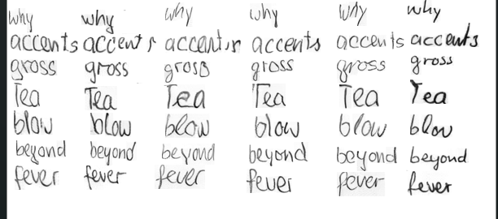

[](LICENSE.md)


# Handwriting Generation: Improving AFFGANwriting by Exploring Deep Learning Models for Style Encoders and Image Generation of Sentence-Level Handwriting

The goal of this project is to investigate whether recent backbone architectures — including ResNet-50, StyleCNN (a customized CNN), Inception-V3, EfficientNetv2-L, and DINOv2-L (a transformer-based model) — can offer performance advantages over the traditional VGG-19 network in capturing individual writing styles and generating more realistic handwriting images.




## Installation
Create a conda environment using the requirements.txt and activate

```console
conda env create -n myenv python 3.10
conda activate myenv
pip install -r requirements.txt
```


Clone the repository and navigate to the directory
```
git clone https://github.com/devo002/Handwriting_generation.git
cd GAN_word
```


## Dataset preparation

The main experiments are run on [IAM](http://www.fki.inf.unibe.ch/databases/iam-handwriting-database) since it's a multi-writer dataset. Furthermore, when you have obtained a pretrained model on IAM, you could apply it on other datasets as evaluation, such as [GW](http://www.fki.inf.unibe.ch/databases/iam-historical-document-database/washington-database).

## How to train it?

First download the IAM word level dataset, then execute `prepare_dataset.sh [folder of iamdb dataset]` to prepared the dataset for training.  
Afterwards, refer your folder in `load_data.py` (search `img_base`). 

Use the config file to specify the backbone model to use for the training as well as the training mode if default training or with the teacher student or knowledge distillation approach which we used to improve the models HTR. 

Then run the training with:

```
bash
./run_train_scratch.sh
```

**Note**: During the training process, two folders will be created: 
`imgs/` contains the intermediate results of one batch (you may like to check the details in function `write_image` from `modules_tro.py`), and `save_weights/` consists of saved weights ending with `.model`.

If you have already trained a model, you can use that model for further training by running:

```
bash
./run_train_pretrain.sh [id]
```

In this case, `[id]` should be the id of the model in the `save_weights` directory, e.g. 1000 if you have a model named `contran-1000.model`.


## How to test it?

I provided two test scripts:

Use the writertest.py to specify the epoch of the best model and the path to the model. You can test with other words.
```
python writertest.py -- epoch id -- writer id
```

* `tt.test_single_writer.4_scenarios.py`: At the beginning of this code file, you need to open the comments in turns to run 4 scenarios experiments one by one.


## How to calculate the CER
```
python cer.py -- /path/to/testimages/
```


## Further Research 

For additional details, you can refer to the GANwriting repository available

- [GANwriting](https://github.com/omni-us/research-GANwriting)


